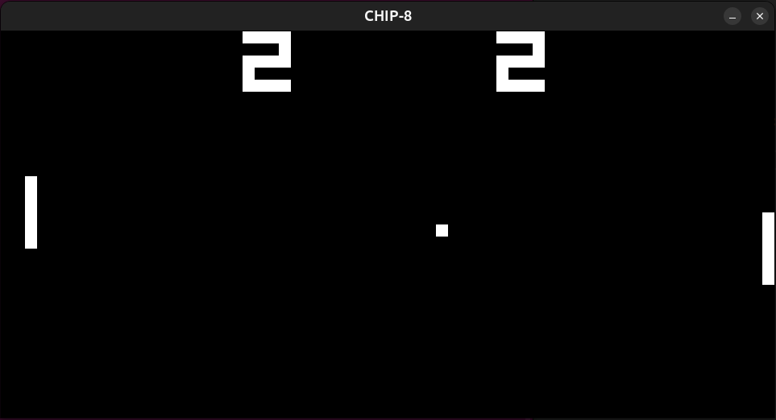

[English](README.en.md) · **Español**

# CHIP-8

# CHIP-8

Este proyecto es un intérprete de CHIP-8, usando SDL para video e inputs. Corre Pong y ROMs clásicas de CHIP-8. Pasa los tests 3-corax+ y 4-flags del test suite de Timendus.



## Sobre este proyecto

Este es el primero de una serie de proyectos que tengo planteados para profundizar en la programación de bajo nivel, que es lo que más me gusta, para encontrar qué rama específica me llama más. Además sirve para ir ganando experiencia y soltura en C.

El proyecto en sí es un intérprete de CHIP-8 y el objetivo final era tener una versión lo suficientemente completa como para correr el Pong y algunas ROMs de la época, dejando de lado detalles más minuciosos a propósito, como el sonido o una UX para debuggear. Cosas que excedían la idea original del proyecto.

## Build y funcionamiento

Necesita `gcc` y SDL2:

```bash
sudo apt install libsdl2-dev
gcc -Wall -Wextra -g chip8.c -o chip8 $(sdl2-config --cflags --libs)
./chip8 roms/pong.ch8         # correr
./chip8 roms/pong.ch8 -d      # la flag -d hace un dump de memoria y le pide al disassembler que imprima las instrucciones de la ROM por consola
```

## Controles

CHIP-8 usaba un pad hexadecimal de 4×4. El estándar de los intérpretes de CHIP-8 es mapear ese bloque de 4×4 geométricamente al teclado, de la siguiente forma:

```
 Pad de CHIP-8          Teclado
   1 2 3 C               1 2 3 4
   4 5 6 D       →       Q W E R
   7 8 9 E               A S D F
   A 0 B F               Z X C V
```

Vale la pena aclarar que la implementación capta el input con scancodes para que sirva también en teclados con otra configuración de teclas (AZERTY por ejemplo), respetando la disposición geométrica.

Cada ROM tiene sus propios controles, pero rara vez están documentados: toca probar las diferentes teclas a ver qué hacen. Particularmente en Pong, con `1` movemos la paleta para arriba y con `Q` para abajo.

## ROMs

Las ROMs no se encuentran en este repositorio ya que algunas tienen licencias para su distribución. Para descargarlas hay dos fuentes muy útiles:

- [Timendus/chip8-test-suite](https://github.com/Timendus/chip8-test-suite) - ROMs de test
- [kripod/chip8-roms](https://github.com/kripod/chip8-roms) - varios juegos clásicos

Ojo que algunas ROMs modernas (Octojam o el [CHIP-8 Archive](https://johnearnest.github.io/chip8Archive/) por ejemplo) están hechas para versiones posteriores como SCHIP o XO-CHIP, y este intérprete no las va a poder correr. Hay que buscar las versiones para CHIP-8 puro.

## Cómo funciona

Técnicamente CHIP-8 no es hardware sino un intérprete de bytecodes que hizo Joseph Weisbecker en 1977. Su propósito era darle una herramienta a los aficionados de los videojuegos para crearlos sin tener que aprender assembly del 1802.

Los programas se escriben en instrucciones de a 2 bytes, big-endian, y se cargan a partir de la dirección `0x200`. En los primeros 512 bytes estaba el código del intérprete en sí.

Lo que está bueno del CHIP-8 es que es lo suficientemente sencillo como para imaginárselo sin dificultades: 4 KB de RAM, 16 registros de 8 bits (`V0`-`VF`), un registro `I` de 16 bits para indexar, un program counter, un stack solo para direcciones de retorno, dos timers de 60 Hz (uno de ellos para sonido), un display blanco y negro de 64×32 y un teclado de 4×4.

El loop principal está sincronizado con los frames, y el programa corre aproximadamente a 60 fps. En cada frame procesamos la lista de eventos de SDL, ejecutamos unas 11 instrucciones, renderizamos, suspendemos la ejecución hasta completar los 16 ms (más adelante explico por qué) y finalmente hacemos un tick en cada timer.

## Decisiones de diseño

### Primero el disassembler

Lo primero que hice fue el disassembler del programa, antes de intentar ejecutar cualquier instrucción.

Esto fue útil principalmente para enfocarme solo en hacer bien la decodificación de las instrucciones, independientemente de su implementación. Gracias a esto podés ver que las instrucciones que está recibiendo el intérprete sean las correctas, porque aunque la implementación de las instrucciones esté bien, si estamos ejecutando la instrucción incorrecta no sirve para nada.

Además sirve como una herramienta de debugueo que todavía se puede usar con la flag `-d`.

Un detalle importante del disassembler es que es lineal y por lo tanto no puede diferenciar entre código y sprites/datos (las ROMs guardan ambos en el mismo espacio de memoria, seguidos uno de otro, sin distinción alguna). Esto implica que va a reportar las instrucciones correctamente hasta entrar en la zona de datos, y a partir de ahí cualquier instrucción que se interprete va a ser basura.

Esto no es un bug o una falla de implementación, es el comportamiento esperado. Decidir si una sección es código o datos estáticamente es, en general, indecidible. Los desensambladores reales usan una técnica llamada *recursive traversal*, que funciona muy bien, pero igual falla cuando hay saltos que se deciden en tiempo de ejecución.

### El PC incrementa en el fetch, no en el execute

En mi implementación se hace fetch y automáticamente se aumenta el PC en 2 (las instrucciones son de 2 bytes) antes de que se ejecute la instrucción. De esta manera el PC siempre apunta a la siguiente instrucción, manteniendo la coherencia de la máquina cuando ejecutamos una instrucción. Por ejemplo:

- `2NNN` (CALL) hace push de una dirección de retorno, la cual ya es el PC que fue incrementado. No hace falta corregir nada.
- Los saltos condicionales suman +2 al PC, quedando claro que nos salteamos una instrucción (en vez de hacer +4, que puede no ser tan evidente de dónde sale).

Además, esta es una práctica estándar en el hardware real. Por ejemplo, el `CALL` en x86 hace push de la dirección que apunta a la siguiente instrucción, y `jal` en RISC-V guarda `pc+4`.

Sin embargo, esto trae un problema que hay que tener muy presente: si una instrucción falla, el PC ya no está alineado con la instrucción que falló. Los procesadores reales resuelven esto con un registro dedicado que guarda la dirección de la excepción: `mepc` en RISC-V, `EPC` en MIPS, `ELR_ELx` en ARM64, `SRR0` en PowerPC. x86 no tiene un registro dedicado y lo empuja al stack frame de la excepción, pero además distingue entre *faults* y *traps* justamente por cuál de las dos direcciones necesita guardar: un fault guarda la instrucción que falló, porque hay que reintentarla, y un trap guarda la siguiente, porque la instrucción ya se completó.

### Un byte por pixel

El display (`uint8_t display[32][64]`) ocupa 2048 bytes pero guarda 2048 bits, así que se desperdicia casi el 90% del espacio. El CHIP-8 original hacía paquetes de 8 píxeles por byte, resultando en 256 bytes, lo que es claramente más eficiente respecto al espacio de memoria.

Sin embargo creo que mi decisión de implementarlo como un array de 32×64 bytes tiene más sentido hoy en día por lo siguiente: si hacemos los paquetes de píxeles, cada acceso requiere varias operaciones seguidas (división, módulo, etc.) y `DXYN` (la instrucción más complicada) hace UN MONTÓN de accesos a píxeles.

En los 70s tenía sentido optimizar al máximo el uso de memoria porque era cara y escasa. Hoy en 2026, sacrificar 1,8 KB para hacer más declarativo el código (accedemos por `display[y][x]`) es algo que nos podemos permitir, y en mi opinión es lo correcto.

### El estado de la máquina se guarda en un struct

No usé variables globales para el estado de la máquina. Todo se guarda en un struct llamado `Chip8` (memoria, registros, timers, etc.) y se pasa por puntero a las funciones que necesiten cambiar el estado.

De esta manera tenemos más claridad sobre lo que puede o no tocar una función: por ejemplo `fetchOpcode(size_t PC, const uint8_t* memory)` recibe una posición y la memoria, que además solo lee, y nada más. Si tuviéramos variables globales perdemos claridad sobre las capacidades de cada función, y además todo el código tendría acceso a toda la máquina, cosa que no corresponde.

### Sincronizar la ejecución con los frames

Esta parte me trabó bastante, la verdad. Al principio había implementado un loop donde se hacía el ciclo fetch-decode-execute y llevaba el registro del delta time con un acumulador para ver cuándo bajaba los timers de 60 Hz. El problema era que el loop corría a la máxima velocidad posible, literalmente unas 10 millones de veces por segundo, y Pong iba a una velocidad absurda. Para hacernos una idea, el CHIP-8 original corría unas 700 instrucciones por segundo aproximadamente.

La solución fue sincronizar con el framerate. Se fijó la ejecución a aproximadamente 60 fps, haciendo un loop que procesa unas 11 instrucciones y frena, dibuja en pantalla, espera a completar los 16 ms del frame y recién ahí baja los timers una vez (porque corren a 60 Hz), eliminando todo el contador de delta time y las cuentas con nanosegundos.

La espera se calcula: se mide cuánto tardó el frame en procesarse y se duerme solo lo que falta. En la práctica el trabajo tarda menos de un milisegundo, así que casi siempre se duermen los 16 completos, pero la lógica está para el caso en que un frame sea pesado de calcular. Son 16 y no 16,67 porque `SDL_Delay` trabaja en milisegundos enteros, así que en realidad corre a unos 62 fps.

Como resultado tenemos unos 62 fps × ~11 instrucciones por frame, dándonos un total de ~690 instrucciones por segundo. Como efecto secundario, los timers también corren a ~62 Hz en vez de 60, un 4% más rápido de lo que deberían.

### Si el stack falla, termina el programa

El stack de CHIP-8 está hecho para guardar direcciones de retorno únicamente, no podés pushear operandos ni nada. El mío tiene una profundidad de 16 direcciones (cosa que se corrobora en `stackPush` y `stackPop`), que es la convención moderna.

Si la pila se corrompe, aborto toda la ejecución y se imprime el PC, porque todo lo que venga después puede ser basura y hace que el error salte un montón de instrucciones más adelante, siendo más difícil encontrar en qué momento tuvimos un error con la pila.

## Quirks

CHIP-8 no tiene una especificación única. Está la del 77 y después un montón de variantes que toman diferentes decisiones, por lo que varias instrucciones tienen dos implementaciones "correctas". A esas diferencias de comportamiento se las conoce como *quirks*, y hay que elegir cuál implementamos. En los tests de Timendus podemos ver qué quirk elegimos en cada caso. Este es un resumen de las implementaciones que tomé yo:

| Quirk | Esta implementación | Nota |
|---|---|---|
| `8XY6` / `8XYE` (shifts) | Operan sobre `VX`, ignoran `VY` | Comportamiento de CHIP-48/SCHIP, que es el que documenta Cowgod. El original hace `VX = VY >> 1`. |
| `FX55` / `FX65` (store/load de registros) | `I` queda sin modificar | El original dejaba `I` apuntando después del último byte, como efecto secundario de cómo el intérprete del 77 recorría la memoria. |
| Clipping de sprites en `DXYN` | Se recorta en los bordes | El origen se envuelve módulo 64/32, pero el sprite en sí no da la vuelta. |
| `BNNN` (salto con offset) | Usa `V0` | Comportamiento original. SCHIP usa `VX`. |
| `FX0A` (esperar tecla) | Retorna al detectar la tecla presionada | El original completaba la instrucción cuando la tecla se **soltaba**. Con esta variante, una tecla mantenida puede disparar la instrucción en frames sucesivos. |
| `FX1E` (`ADD I, Vx`) | No modifica `VF` | Hay implementaciones (heredadas de una versión de Amiga) que ponen `VF` en 1 si `I` supera `0x0FFF`. |
| VF reset en `8XY1` / `8XY2` / `8XY3` | **Sin implementar** | El original pone `VF` en 0 como efecto secundario de OR/AND/XOR. |
| Display wait | **Sin implementar** | El original sincronizaba `DXYN` con el vertical blank, lo que limita el dibujo a un sprite por frame. |

Las dos que dicen "sin implementar" son la razón por la cual los sprites parpadean (más abajo profundizo en esto). No es que no me di cuenta: elegí no meterme por el momento en este proyecto.

## Testing

Verificado contra el [test suite de CHIP-8 de Timendus](https://github.com/Timendus/chip8-test-suite):

- **`3-corax+`** - pasa. Cubre la mayor parte del set de instrucciones.
- **`4-flags`** - pasa. Este es el interesante: chequea que `VF` se escriba siempre (0 además de 1, porque si no queda prendido un flag de una operación anterior), que el flag se calcule *antes* de que el resultado pise un operando, y que se escriba *después* del resultado, para que `8FY4` y similares dejen el flag y no la suma en `VF`.
- **`5-quirks`** - resultados en la tabla de arriba.

Nota al pie: cuando corrí `3-corax+`, por suerte pasó todos los tests, pero tuve que romper a propósito alguna implementación para ver que los tests realmente estuvieran funcionando.

## Limitaciones

- **No hay sonido.** El timer baja, pero no emite ningún ruido.
- **El flickering de los sprites.** Algunos juegos con mucho movimiento en pantalla parecen parpadear. Esto es porque para mover un objeto en CHIP-8 primero se borra el sprite anterior y se lo vuelve a dibujar desfasado. Muchas veces un frame se dibuja cuando ya se borró el sprite pero todavía no se dibujó el nuevo, y en consecuencia parece que desaparece y aparece. Hay un par de soluciones conocidas, pero escapaban al scope de este proyecto y tienen sus trade-offs al implementarlas. Por el momento decidí dejarlas de lado.
- **El disassembler decodifica datos como instrucciones**, aunque para un disassembler lineal eso está bien.
- **Los accesos a memoria no están acotados.** Nada garantiza que el PC o `I` se queden dentro de los 4096 bytes, así que una ROM que se descarrile puede leer o escribir fuera del array. Con las ROMs que probé no pasa, pero es algo que hay que cerrar.

## Referencias

- [Tobias V. Langhoff — *Guide to making a CHIP-8 emulator*](https://tobiasvl.github.io/blog/write-a-chip-8-emulator/) - explica qué tiene que hacer cada parte sin darte el código, y documenta bien las quirks.
- [*Cowgod's Chip-8 Technical Reference v1.0*](http://devernay.free.fr/hacks/chip8/C8TECH10.HTM) - la referencia de opcodes, abierta en una pestaña durante todo el proyecto.
- [Timendus' CHIP-8 test suite](https://github.com/Timendus/chip8-test-suite)
